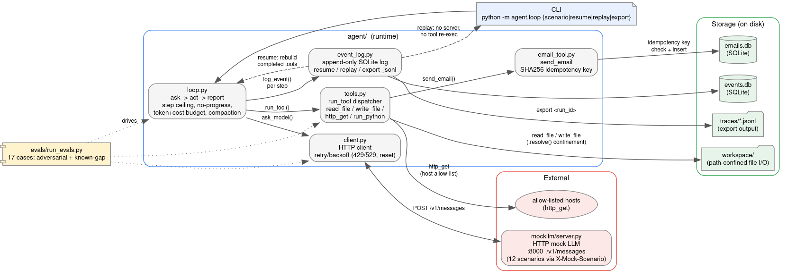

# DECISIONS.md

## Scope and triage

Given the 6-hour cap and my own learning curve on HTTP servers, SQLite, and subprocess, I prioritised the heaviest-graded items first — R2 (exactly-once), R4 (injection), R7 (evals), then R3 (compaction), R5 (budgets), R6 (observability) and built outward from a working S1 loop. All 12 scenarios (S1–S12) are handled; the honest limitations are documented below.

## What's done vs deferred

**Fully addressed:** R1 (loop, all 12 scenarios), R4 (structural injection defense), R5 (budgets + graceful stop), R6 (event log, resume, replay, JSONL export), R8 (this write-up).

**Mostly:** R2 (exactly-once via idempotency key + SQLite + resume; verified by simulation, NOT a real chaos harness — my #1 gap). R7 (17 evals, 7 adversarial, 2 honest known-gaps; no baseline diff).

**Partial:** R3 (compaction works and stays under budget, but is generic, not fact-preserving).

## Architecture

Small, single-responsibility modules:

- `agent/client.py` — the only code that talks HTTP to mockllm; owns retry/backoff for both rate-limit (429/529) and connection-reset failures.
- `agent/loop.py` — the ask -> act -> report loop: step ceiling, no-progress detection, token/cost budgets, compaction, resume, and replay.
- `agent/tools.py` — the five tools plus a `run_tool` dispatcher.
- `agent/email_tool.py` — send_email with an idempotency key + recipient allow-list.
- `agent/event_log.py` — an append-only SQLite event log + resume/replay helpers.

**Key decision: structural safety over pattern-matching.** All three trust boundaries use the same shape, an allow-list checked before the action, not a blocklist. File tools resolve the path with `.resolve()` and verify it stays inside `workspace/`; `http_get` checks the host against an allow-list; `send_email` checks the recipient against an approved set. S7's injection fails structurally: the model can ask to email an attacker, but the recipient isn't approved, regardless of what any file said.

## Assumptions

- `harness/chaos.py` and `mockllm/` are not in the provided repo, so I assumed that the candidate supplies them; I built mockllm and deferred the chaos harness.
- `send_email` is idempotent on (to, subject, body). I assume the same three fields identify a "logical send."
- The grader runs its own chaos harness against my agent, so my exactly-once design must hold even though I verified it only by simulation.

## Exactly-once (R2)

send_email derives a SHA256 idempotency key from (to, subject, body). Before inserting, it checks the key in SQLite; if present, it SKIPS. Combined with the append-only event log and `resume` a re-run after a crash skips any already-sent email. Verified with a crash *simulation* (test_crash.py): 1 SENT + 2 SKIPPED -> count == 1.

## Compaction (R3)

Each step counts conversation tokens via mockllm/tokenizer.py. At a 6k threshold the loop keeps the task + the most recent 4 messages and replaces the middle with a placeholder note, then enforces the 8k ceiling. Verified on S8: the run compacts and continues instead of failing the budget.

**Defended against one alternative:** a pure sliding window. I keep the task explicitly so the agent never forgets its goal. But my summary is generic, not fact-preserving (see limitations).

## Observability (R6)

Every run writes structured events (run_start, tool_call, tool_result, run_end) to an append-only SQLite log. `resume` continues a crashed run; `replay` reproduces the transcript with no server and no tool re-execution; `export` dumps a JSONL trace (one event per line) from the same log.

## Scenario handling notes

All 12 scenarios are handled. S1 (happy path), S3 (bad/unknown tool, via run_tool's exception handling), S4 (infinite loop, via no-progress detection), S7 (injection, via the recipient allow-list), and S8 (context growth, via compaction) are covered by the mechanisms above. The rest need a specific note:

- **S2 (malformed JSON):** parse_tool_input accepts a stringified tool input and repairs trailing commas via regex.

- **S5 / S12 (connection reset / interrupted turn):** the reset surfaces as an IncompleteRead. I moved response.json() inside the retry try/except and retry on ConnectionError / ChunkedEncodingError — no http.client rewrite needed. S12 also exercises parallel tools + injection in the same turn.

- **S6 (429/529):** client.py retries honoring Retry-After, capped at MAX_RETRIES=5.

- **S9 (duplicate ids):** the agent never uses the model's tool_use id as a key, so id reuse can't corrupt state.

- **S10 (parallel fail+hang):** the loop processes ALL tool_use blocks; run_python's timeout absorbs the hang.

- **S11 (confidently wrong):** the agent tracks tools that actually errored and warns when the model claims success but a tool really failed.

## The three (plus) places it's still unsafe

1. **Real kill -9 is UNVERIFIED — this is my biggest gap (R2, grading #1).** R2 asks that harness/chaos.py be run 100 times asserting exactly-once. That harness is not present in my repo and I did not build it. I verified exactly-once via a *simulation* (re-calling functions), not a real process kill mid-INSERT. My design *should* survive it. The idempotency key is on disk, SQLite commits are atomic, and resume rebuilds from the event log.

2. **run_python has no memory cap or network isolation.** It runs model code in a subprocess with a 5s wall-clock timeout only. A memory bomb or an outbound network call from inside the sandbox is not contained.
fix: resource.setrlimit via preexec_fn for memory, and namespaces for network.

3. **Failed-tool detection is string-based.** The loop flags failures by matching "ERROR"/"REFUSED" (case-insensitively). 

## Other honest limitations

- **Compaction is not fact-preserving (R3, grading #5).** The middle is replaced by a generic placeholder, not a content summary.

- **Evals have no stored-baseline diff (R7).** I print a pass rate (17 cases, 7 adversarial, 2 honest known-gaps) but don't diff against a saved baseline.
- **Connection-reset retry re-issues the whole request.** If a tool already ran server-side before the reset, retrying re-calls it; for irreversible tools only the idempotency key protects exactly-once.

- **mockllm is AI-scaffolded.** The mock server was built with heavy AI assistance;

## With one more day

- Build and run a real kill -9 chaos harness; 
- Compaction with pinned facts - long-horizon recall task.
- memory cap (setrlimit) + network isolation.
